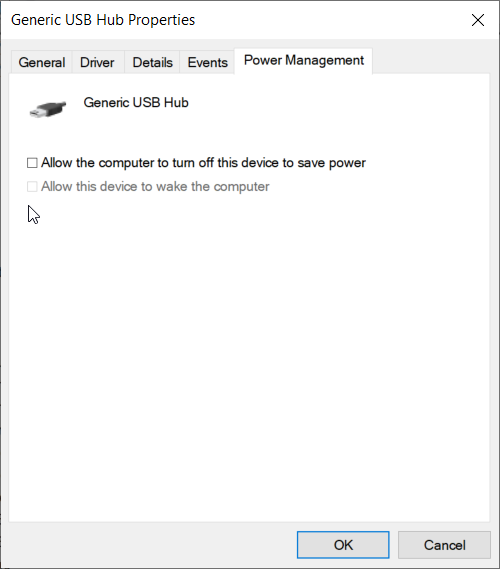
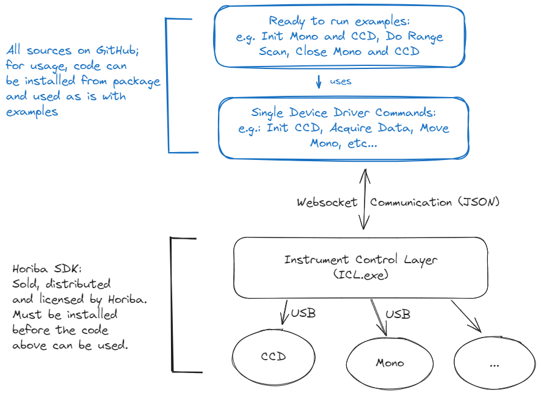

# HORIBA CPP SDK

[](https://github.com/HORIBAEzSpecSDK/cpp-sdk/actions)
[](https://github.com/HORIBAEzSpecSDK/cpp-sdk/actions)
[](https://github.com/HORIBAEzSpecSDK/cpp-sdk/actions)
[](https://github.com/HORIBAEzSpecSDK/cpp-sdk/actions)
[](https://github.com/HORIBAEzSpecSDK/cpp-sdk/actions)
<!-- [](https://github.com/HORIBAEzSpecSDK/cpp_sdk/actions/workflows/codeql-analysis.yml) -->
[](https://HORIBAEzSpecSDK.github.io/cpp-sdk/)

*horiba-cpp-sdk* is a C++ library that provides source code for the development with HORIBA devices.

___

⬇️⬇️⬇️⬇️⬇️⬇️⬇️⬇️⬇️⬇️⬇️⬇️⬇️⬇️⬇️⬇️⬇️⬇️⬇️⬇️⬇️⬇️⬇️⬇️⬇️⬇️⬇️⬇️⬇️⬇️⬇️

> [!WARNING]
> This SDK is under development and not yet released.

> [!IMPORTANT]
> For this C++ code to work, the SDK from HORIBA has to be purchased, installed and licensed.
> The code in this repo and the SDK are under development and not yet released for public use!

⬆️⬆️⬆️⬆️⬆️⬆️⬆️⬆️⬆️⬆️⬆️⬆️⬆️⬆️⬆️⬆️⬆️⬆️⬆️⬆️⬆️⬆️⬆️⬆️⬆️⬆️⬆️⬆️⬆️⬆️⬆️

___

# 📦 About this repository

`horiba-cpp-sdk` is a library that provides source code for the development of custom applications that include
interaction with HORIBA devices, namely monochromators and multichannel detectors (e.g. CCD cameras). Future versions of
this package will include access to more devices. The SDK exists for several programming languages:

* [C++](https://github.com/HORIBAEzSpecSDK/cpp-sdk) (This repository)
* [Python](https://github.com/HORIBAEzSpecSDK/python-sdk)
* [C#](https://github.com/HORIBAEzSpecSDK/dotnet-sdk)
* [LabVIEW](https://github.com/HORIBAEzSpecSDK/labview-sdk)

# ☑️ Prerequisites

* CMake 3.22
* C++20 compiler, see [Dependency Setup](README_dependencies.md) for mor information.
* ICL.exe installed as part of the `HORIBA SDK`, licensed and activated. The HORIBA SDK can be purchased by contacting
  the [Horiba Support](https://www.horiba.com/int/scientific/contact/) and sending a message to the `Scientific`
  business segment, specifying `no division` and selecting the `sales` department
*
  <details>
  <summary>To make sure that the USB devices do not get disconnected, uncheck the following boxes in the properties</summary>

  

  </details>

# 🛠️ Getting Started

> [!WARNING]
> This example only works under Windows.

## Prerequisites


1. Create a new folder with the following structure:

   ```text
   horiba_basic_example
   ├── CMakeLists.txt
   └── main.cpp
   ```
2. Get the `CPM.cmake` CMakeLists script from https://github.com/cpm-cmake/CPM.cmake/releases/tag/v0.38.7 and put it in the `cmake` folder

   Or get the latest using the following command:

   ```bash
   mkdir -p cmake
   wget -O cmake/CPM.cmake https://github.com/cpm-cmake/CPM.cmake/releases/latest/download/get_cpm.cmake
   ```

3. Create a CMakeLists.txt in the root folder:

   <details><summary>CMakeLists.txt</summary>

   ```cmake
    cmake_minimum_required(VERSION 3.22)

    set(CMAKE_CXX_STANDARD 20)
    set(CMAKE_CXX_STANDARD_REQUIRED ON)

    project(horiba_cpp_example)

    include(cmake/CPM.cmake)

    CPMAddPackage(
        NAME horiba-cpp-sdk
        GITHUB_REPOSITORY HORIBAEzSpecSDK/cpp-sdk
        GIT_TAG v0.2.1
        OPTIONS
            # Uncomment if you enable hardening options
            "horiba_cpp_sdk_ENABLE_HARDENING OFF"
            "horiba_cpp_sdk_ENABLE_GLOBAL_HARDENING OFF"
        )

    add_executable(horiba_cpp_example main.cpp)

    target_link_libraries(horiba_cpp_example PRIVATE
        horiba_cpp_sdk::horiba_cpp_sdk
        )
   ```
   </details>

4. Put the following into the `main.cpp`:

   <details><summary>main.cpp</summary>

   ```c++
   #include <chrono>
   #include <iostream>
   #include <thread>

   #include <nlohmann/json.hpp>

   #include <horiba_cpp_sdk/devices/icl_device_manager.h>
   #include <horiba_cpp_sdk/devices/single_devices/ccd.h>
   #include <horiba_cpp_sdk/devices/single_devices/mono.h>
   #include <horiba_cpp_sdk/os/windows_process.h>

   auto main(int argc, char *argv[]) -> int {
     using namespace nlohmann;
     using namespace horiba::devices;
     using namespace horiba::os;
     using namespace horiba::devices::single_devices;
     using namespace horiba::communication;
     using namespace std;

     auto icl_process = std::make_shared<WindowsProcess>(R"(C:\Program Files\HORIBA Scientific\SDK\)", R"(icl.exe)");
     auto icl_device_manager = ICLDeviceManager(icl_process);

     icl_device_manager.start();
     icl_device_manager.discover_devices();

     const auto ccds = icl_device_manager.charge_coupled_devices();
     const auto ccd = ccds[0];

     const auto monos = icl_device_manager.monochromators();
     const auto mono = monos[0];
     const auto timeout = chrono::seconds(180);

     try {
       ccd->open();
       mono->open();
       mono->wait_until_ready(timeout);

       mono->home();
       mono->wait_until_ready(timeout);

       auto target_wavelength = 123.0;
       mono->move_to_target_wavelength(target_wavelength);
       mono->wait_until_ready(timeout);

       ccd->set_acquisition_format(1, ChargeCoupledDevice::AcquisitionFormat::SPECTRA);
       ccd->set_acquisition_count(1);
       ccd->set_x_axis_conversion_type(ChargeCoupledDevice::XAxisConversionType::FROM_ICL_SETTINGS_INI);
       ccd->set_timer_resolution(ChargeCoupledDevice::TimerResolution::THOUSAND_MICROSECONDS);
       ccd->set_exposure_time(2);
       ccd->set_region_of_interest();

       if (ccd->get_acquisition_ready()) {
         auto open_shutter = true;
         ccd->set_acquisition_start(open_shutter);
         // wait a short time for the acquisition to start
         std::this_thread::sleep_for(std::chrono::milliseconds(200));

         while (ccd->get_acquisition_busy()) {
           std::this_thread::sleep_for(std::chrono::milliseconds(500));
         }

         auto raw_data =
             std::any_cast<nlohmann::json>(ccd->get_acquisition_data());
         cout << raw_data.dump() << endl;
       }

     } catch (const exception &e) {
       cout << e.what() << endl;
       ccd->close();
       mono->close();
       icl_device_manager.stop();
       return 1;
     }

     try {
       ccd->close();
       mono->close();
       icl_device_manager.stop();
     } catch (const exception &e) {
       cout << e.what() << endl;
     }

     return 0;
   }

   ```
   </details>


5. Run `cmake -S . -B ./build -G Ninja` (replace `Ninja` with `"Unix Makefiles"` if you don't have Ninja or with `"Visual Studio 17 2022"` if you use Visual Studio 2022)

6. Run `cmake --build build`

7. Launch the example with `./build/horiba_cpp_example`


# 🏗️ Architecture

The functionality is distributed over two parts, the `instrument control layer (ICL)` and the `github source code`. This
split is shown in the following image:


The ICL itself is sold and distributed by HORIBA. The source code to communicate with the ICL and drive the instruments
is located in this repo for C++, but can be also found for Python, C#, C++ and LabVIEW as described above.
The communication between SDK and ICL is websocket based. I.e. in essence the ICL is steered by a `command and control`
pattern where commands and their replies are JSON commands.

# 🔗 Examples

For more details on the usage of the library and a list of examples, see:
 * [Usage Examples](src/examples/README_examples.md)

# 👩‍💻 First steps as contributor

For contributors to the library:
 * [Dependency Setup](README_dependencies.md)
 * [Building Details](README_building.md)
 * [Docker](README_docker.md)

## Credits

* Cmake project template from [lefticus](https://github.com/cpp-best-practices/cmake_template)
* GitHub Actions CI/CD from [TheLartians](https://github.com/TheLartians/ModernCppStarter)
